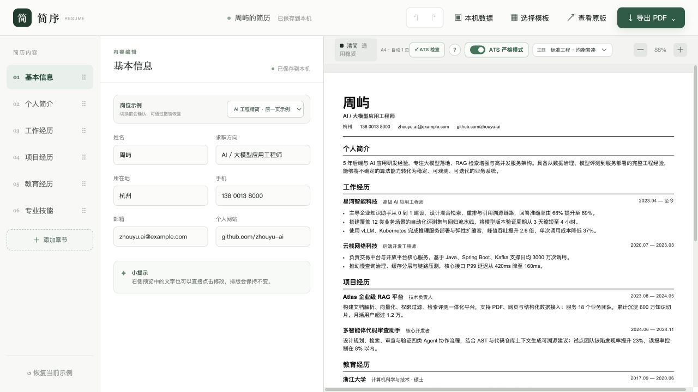
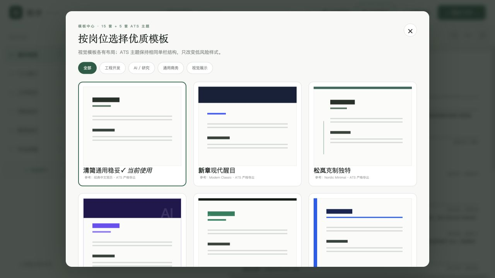
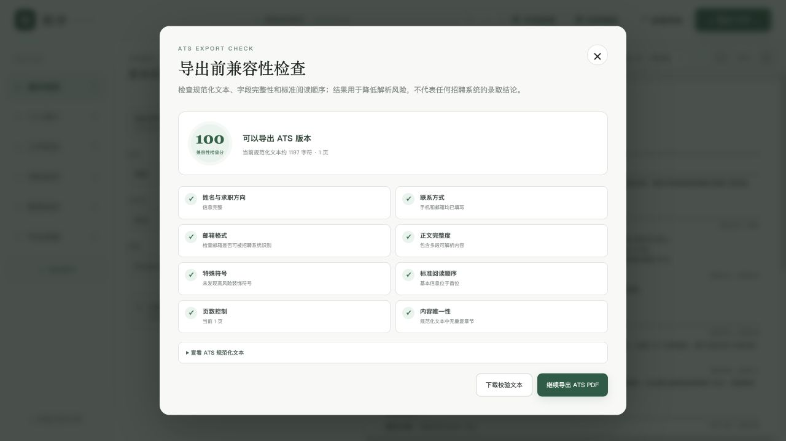

# ResumeCraft（简序）—— 所见即所得的 ATS 友好简历编辑器

面向校招开发工程师、资深工程师、AI 算法/应用工程师和产品经理的在线简历制作工具。无需注册，打开网页即可选择模板、编辑内容、实时预览，并导出视觉版或 ATS 版 PDF。

**推荐直接使用在线版：** [https://juicyzhou.github.io/ResumeCraft/](https://juicyzhou.github.io/ResumeCraft/)

[开始在线制作简历](https://juicyzhou.github.io/ResumeCraft/) · [查看部署说明](./GITHUB_PAGES.md)

> 简历内容默认只保存在当前浏览器的本地存储中，不会上传到 GitHub，也不会被其他用户实时看到。重要修改建议使用“本机数据 → 导出简历备份”保存 JSON 备份。



## 为什么使用 ResumeCraft

写简历最困难的部分通常不只是排版，而是同时处理内容结构、岗位针对性、页面长度和招聘系统解析。ResumeCraft 将这些工作放在同一个编辑界面中：

- **所见即所得**：左侧填写内容，右侧同步显示最终 A4 排版；预览中的文字也可以直接编辑。
- **15 套视觉模板**：包含 Markdown 文档流、工程技术、学术研究、时间轴、双栏、极简和浅色横章等布局。
- **5 套 ATS 低风险主题**：保持单栏和线性阅读顺序，仅调整字体、字号、间距与分隔线。
- **岗位示例可直接改写**：内置校招开发、资深工程、AI 算法、产品经理、AI 工程精简版和完整多页版。
- **结构化内容管理**：工作、项目和教育经历可以任意新增、删除；章节支持拖动排序。
- **专业章节库**：可添加校园经历、荣誉奖项、证书、论文、专利、开源贡献、作品集和语言能力。
- **自动 A4 分页**：预览与 PDF 使用一致的分页切点，支持同一章节自然跨页，并避免页末只留下章节标题。
- **双模式 PDF 导出**：视觉版保留模板风格；ATS 版使用更保守的单栏结构。
- **导出前 ATS 检查**：检查身份信息、联系方式、邮箱格式、正文完整度、特殊符号、阅读顺序、页数和重复章节。
- **本地数据安全**：自动保存、撤销/重做、JSON 备份导入导出，不依赖账号和云端数据库。

## 适合哪些求职者

| 求职方向 | 推荐内容重点 | 推荐用法 |
| --- | --- | --- |
| 校招开发工程师 | 基础能力、实习、项目、竞赛与校园经历 | 选择“校招开发”示例，以一页为优先 |
| 资深开发/架构师 | 系统规模、稳定性、成本、技术决策和团队影响力 | 选择“资深工程”示例，使用高密度或 Markdown 模板 |
| AI 算法工程师 | 数据规模、模型指标、训练评测、推理优化与论文 | 选择“AI 算法”示例，补充论文/专利/开源章节 |
| AI 应用工程师 | RAG、Agent、评测、服务部署和业务效果 | 使用 AI 工程示例，在技能中采用“分组详述”模式 |
| 产品经理 | 用户问题、方案判断、协作过程、业务指标与作品集 | 选择“产品经理”示例，添加作品集章节 |

## 三分钟开始使用

### 1. 打开在线编辑器

访问 [ResumeCraft 在线版](https://juicyzhou.github.io/ResumeCraft/)。无需安装或注册，建议使用最新版 Chrome 或 Edge，以获得更稳定的 PDF 打印效果。

### 2. 选择与岗位接近的示例

在中间编辑栏顶部选择岗位示例。示例不是固定模板，而是一套可以完全修改的内容参考。切换前网站会确认，误操作也可以撤销。

### 3. 按章节替换内容

从基本信息开始，依次填写个人简介、工作经历、项目经历、教育经历和专业技能：

- 每条成果尽量写成“做了什么 + 解决什么问题 + 产生什么结果”。
- 技术岗位建议选择“分组详述”，分别描述编程基础、算法/后端、数据和工程能力。
- 没有内容的章节可以删除或留空；工作、项目和教育经历可以按实际数量增删。

### 4. 选择模板并检查分页

点击顶部“选择模板”，按工程开发、AI / 研究、通用商务或视觉展示筛选。内容较少时优先一页；内容较多时让系统按真实 A4 高度自动分页，不需要手工插入空行。



### 5. 运行 ATS 检查

投递招聘系统前开启“ATS 严格模式”，选择一套 ATS 主题，然后点击“ATS 检查”。修复失败项，并根据警告判断是否需要精简正文或调整顺序。



### 6. 导出和备份

点击“导出 PDF”，根据用途选择：

- **原版 PDF**：适合直接发送给招聘者、内推人或面试官，保留当前模板布局与颜色。
- **ATS PDF**：适合上传到招聘网站，使用单栏、明确标题和标准阅读顺序。

完成后进入“本机数据”导出 JSON 备份。更换浏览器、清除浏览器数据或使用其他设备前，请先下载备份文件。

## 使用案例

### 案例一：校招后端开发工程师

1. 选择“校招开发 · 一页优先”。
2. 保留教育经历、实习和两个项目，把课程描述替换为个人真实内容。
3. 添加荣誉奖项或校园经历；没有工作经历时可直接删除空记录。
4. 选择“极客标准”或“文档流”，运行 ATS 检查后导出 ATS PDF。

适合突出：Java/Spring Boot 基础、数据库与缓存、实习职责、项目难点、竞赛和量化结果。

### 案例二：资深工程师/技术负责人

1. 选择“资深工程 · 架构与影响力”。
2. 将每段经历改写为业务规模、技术决策、性能/稳定性结果及团队影响。
3. 使用“技术简报”“文档流”或“时序”模板检查信息密度。
4. 保留两页以内的高价值内容，分别导出视觉版和 ATS 版。

适合突出：高并发、可用性、成本治理、架构迁移、研发效能和带队规模。

### 案例三：AI 算法/大模型工程师

1. 选择“AI 算法”或“AI 工程完整”示例。
2. 使用多行技能描述，明确数据、训练、评测、推理和部署能力。
3. 添加论文、专利或开源贡献章节，并给出数据量、F1/Recall、延迟和成本变化。
4. 使用“研究序列”制作展示版，同时导出 ATS 单栏版用于网申。

适合突出：PyTorch、Transformers、RAG、LoRA、vLLM、评测体系、GPU 成本与业务指标。

### 案例四：AI 产品经理

1. 选择“产品经理 · 产品与指标”。
2. 用“用户问题—产品判断—推动过程—业务结果”描述工作和项目。
3. 添加作品集章节，放置脱敏案例链接。
4. 选择清简、商务留白或浅色横章风格，检查两种 PDF 导出效果。

适合突出：用户研究、路线图、跨团队交付、采纳率、留存/续费、效率和商业结果。

## ATS 模式说明

ATS（Applicant Tracking System，申请人追踪系统）常用于接收、解析和筛选简历。复杂双栏、图标代替文字、文本框、图片化文字和异常阅读顺序都可能增加解析风险。

ResumeCraft 的 ATS 严格模式会：

- 使用单栏线性布局和常见字体；
- 保留清晰的姓名、联系方式和标准章节标题；
- 将技能和经历输出为可复制、可搜索的文本；
- 按用户设置的章节顺序生成规范化文本；
- 在导出前检查常见风险项。

不同招聘系统的规则并不完全公开或一致，因此“检查通过”表示当前简历满足本项目定义的低风险规则，**不代表对所有 ATS 的绝对兼容，也不代表招聘结果**。重要岗位建议同时保留原版 PDF、ATS PDF 和纯文本内容。

## 数据与隐私

- 简历内容、模板设置和章节顺序默认保存在当前浏览器的 `localStorage`。
- 在线版没有把简历草稿上传到 GitHub，也没有让不同访问者共享同一份数据。
- 清除网站数据、使用无痕窗口或更换设备可能导致本地草稿不可用。
- 使用“本机数据”可导出/导入完整 JSON 备份。
- PDF 由浏览器打印功能在本机生成。

如果你计划部署自己的副本，当前静态版本同样采用浏览器本地存储，不需要数据库或账号系统。

## 本地安装与开发

### 环境要求

- Node.js `>= 22.13.0`
- npm（随 Node.js 安装）
- Git

### 启动开发环境

```bash
git clone git@github.com:juicyzhou/ResumeCraft.git
cd ResumeCraft
npm ci
npm run dev
```

浏览器访问 [http://localhost:3000/](http://localhost:3000/)。

如果没有配置 GitHub SSH，也可以使用 HTTPS：

```bash
git clone https://github.com/juicyzhou/ResumeCraft.git
```

### 常用命令

```bash
npm run dev          # 启动本地开发服务器
npm run build        # 构建 Sites / Vinext 版本
npm run build:pages  # 构建 GitHub Pages 静态版本
npm run preview:pages # 本地预览静态构建
npm test             # 构建并运行 ATS 校验测试
npm run lint         # 运行代码检查
```

## 部署到 GitHub Pages

本项目已包含 `.github/workflows/deploy-pages.yml`，不需要服务器、数据库或付费托管即可部署。

1. Fork 本仓库，或将代码推送到你自己的 GitHub 仓库。
2. 打开仓库 **Settings → Pages**。
3. 在 **Build and deployment** 中将 Source 设为 **GitHub Actions**。
4. 推送到 `main` 分支，或在 Actions 页面手动运行部署工作流。
5. 部署完成后访问 `https://<你的用户名>.github.io/<仓库名>/`。

构建流程会使用 Node.js 22 执行 `npm ci` 和 `npm run build:pages`，然后发布 `gh-pages-dist`。详细说明和回滚点见 [GITHUB_PAGES.md](./GITHUB_PAGES.md)。

> 如果修改仓库名称或部署到子路径，当前 Vite 配置会根据 GitHub Actions 环境推导仓库路径；发布后仍建议检查页面资源、刷新和 PDF 导出。

## 项目结构

```text
ResumeCraft/
├── app/
│   ├── ResumeStudio.tsx       # 编辑器、模板、分页、备份和导出交互
│   ├── ats-validation.mjs     # ATS 规范化文本与兼容性检查
│   ├── globals.css            # 网站界面、模板和打印样式
│   ├── layout.tsx             # 页面元信息
│   └── page.tsx               # 应用入口
├── docs/images/               # README 实际页面截图
├── public/                    # 图标、分享图和静态资源
├── static-entry/main.tsx      # GitHub Pages 静态入口
├── tests/                     # ATS 校验自动化测试
├── .github/workflows/         # GitHub Pages 自动部署
└── GITHUB_PAGES.md            # 静态部署与回滚说明
```

## 技术实现

- React 19 + TypeScript
- Next.js / Vinext + Vite
- CSS A4 分页与打印样式
- 浏览器 `localStorage` 本地持久化
- GitHub Actions + GitHub Pages 静态部署
- Node.js 原生测试框架验证 ATS 文本和规则

## 常见问题

### 在线版会保存我的简历到云端吗？

不会。当前版本默认只写入你浏览器的本地存储。A 用户编辑的内容不会被 B 用户看到。

### 为什么换一台电脑后看不到之前的内容？

本地存储不会跨设备同步。请在原设备导出 JSON 备份，再在新设备导入。

### 应该导出原版还是 ATS 版？

网申和招聘系统上传优先 ATS 版；直接发给招聘者或面试官可使用原版。稳妥做法是同时保留两份。

### 为什么预览会自动变成两页？

页面按照真实 A4 可用高度计算。当内容超过一页时会自动分页，预览切点与 PDF 导出保持一致。

### 可以添加默认列表之外的内容吗？

可以。点击左侧“添加章节”，可选择结构化章节或自由文本章节，并参与排序、分页和 ATS 导出。

### PDF 中的颜色或边距与预览略有不同怎么办？

建议使用最新版 Chrome/Edge，在打印面板中选择 A4、默认缩放，并启用背景图形。不要额外设置浏览器页眉页脚。

## 参与改进

欢迎通过 GitHub Issues 提交：

- 不同岗位的高质量示例建议；
- 模板、分页和浏览器打印问题；
- ATS 解析测试结果和可复现样例；
- 无障碍、移动端和内容写作体验改进。

提交代码前建议运行：

```bash
npm test
npm run build:pages
npm run lint
```

---

如果 ResumeCraft 帮助你更清楚地表达经历，欢迎 Star 仓库，或把[在线编辑器](https://juicyzhou.github.io/ResumeCraft/)分享给正在准备简历的朋友。
